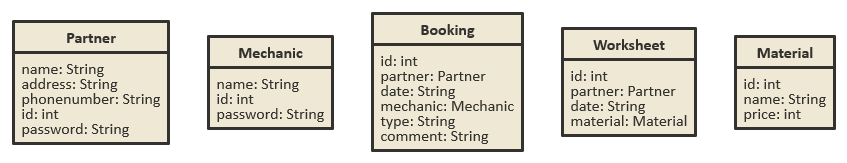
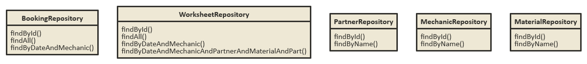

# Autószerviz
Alkalmazások fejlesztése beadandó (példa 6.)

Taskok: https://trello.com/b/LS7PpLk3/aut%C3%B3szerviz

Készítsünk kliens-szerver rendszert, amellyel egy autószerviz bejelentkezési
naptárát, valamint munkalap kezelését tudjuk elősegíteni.
A partnerek időpontokat a webes felületen keresztül kérhetnek.

• A partner regisztrálhat (név, cím, telefonszám, azonosító, jelszó megadásával),
majd bejelentkezhet/kijelentkezhet. Bejelentkezést követően látható a
foglalási naptár (az aktuális dátumtól), ahol szerelőnként láthatjuk a szabad,
illetve foglalt időpontokat.

• Egy partner több időpontot is foglalhat, a naptárban látja a saját foglalásait,
illetve a további foglalásokat, de utóbbiak esetén csupán a „foglalt” állapotot, a
másik partner adatait nem.

• Az időpont foglaláshoz ki kell választani egy szabad időpontot (minden nap 9
és 17 óra között, csak egész órára), a kategóriát (kötelező szerviz, műszaki
vizsga, illetve meghibásodás), valamint lehet megjegyzést írni. Minden
foglalás 1 óra időtartamú. Természetesen csak jövőbeli időpontok
foglalhatóak.

• A foglalásokat később (de még az időpontja előtt) lehet törölni is.
A szerelők a munkalapokat a grafikus felületen keresztül adminisztrálják.

• A szerelő bejelentkezhet (azonosító és jelszó megadásával) a programba.
Sikeres bejelentkezést követően látja a rá vonatkozó foglalásokat (az aktuális
dátumtól), illetve kijelentkezhet.

• Bejelentkezést követően listázódnak (a munkalappal nem rendelkező)
foglalások (időpont, foglaló neve, kategória). Egy foglalást kiválasztva új
munkalap nyitható (a partner adatai és az időpont automatikusan
áttöltődnek).

• A munkalapra tetszőleges számú munkafolyamat, illetve alkatrész vihető fel
kiválasztva az előre megadott adatok alapján. Ezeket törölni is lehet a felvitel
után. A munkalapon látható a végösszeg, amely az egyes tételek
hozzáadásával/törlésével változik. Végül a szerelő véglegesítheti a
munkalapot (ehhez a program kérjen megerősítést).

Az adatbázis az alábbi adatokat tárolja:

• partnerek (név, cím, telefonszám, azonosító, jelszó);

• szerelők (név, azonosító, jelszó);

• foglalások (partner, időpont, szerelő, típus, megjegyzés);

• munkalapok (partner, szerelő, anyagok és alkatrészek);

• anyagok, alkatrészek, óradíj (név, egységár). 

Követelmények:

1) Adatbázis

- legalább 4 tábla

- legyen benne 1-sok kapcsolat

- legyen benne sok-sok kapcsolat

- az adatbázis-kezelő az órán megismert h2 rendszer lehet

2) Szerveroldal

- Java Spring Boot technológia használata

- MVC modell

- REST API

- authorizált végpontokkal

3) Kliensoldal

- technológiát illetően az órán megismert Angular keretrendszert kell használni (2+ verzió).

- legalább három tábla adatait szerkeszteni kell tudni a felületen: lista, új, módosít, töröl (vagy inaktívvá tesz)

- legyenek benne csak hitelesítés után elérhető funkciók (autentikáció)

- ügyelni kell, hogy csak a megfelelő adatokhoz férjen hozzá a megfelelő felhasználó (autorizáció)

- a szerverrel AJAX kérésekkel történjen a kommunikáció

**Osztálymodell**

*Táblák:*

*Osztályok:*

>Model:

>Controller:

>PartnerController:
A rendszer elérhetőségét biztosítja a partnereknek a /partner aloldalain keresztül.

Partnerre vonatkozó:
A login(name, password) függvény a bejelentkezési adatokat kéri, nevet (name) és jelszót (password). A /login aloldalon érhető el, és POST requesten keresztül kéri be a paramétereit. Sessionbe tárolja el a felhasználó adatait kijelentkezésig. Amennyiben a partner adatai nem helyesek, hibát dob.

A register(name, address, phonenumber, password) függvény kéri a nevet (name), címet (address), telefonszámot (phonenumber) és jelszót (password). A /register aloldalon érhető el, és POST requesten keresztül kéri be a paramétereit. Ha nem talál egyező nevű partnert, elhelyezi az új sort az adatbázisban, és visszaadja a létrehozott entity adatait. Ellenkező esetben hibát dob.

A logout() függvény paraméter néküli, mindig a sessionben éppen tárolt partnert jelentkezteti ki a session kiürítésével. A /logout aloldalon keresztül érhető el.

Foglalásokra vonatkozó:
A bookList(mechanicid) függvény a szerelő azonosítóját (mechanicid) kéri. A /booklist aloldalon érhető el és POST requesten keresztül kéri be a paraméterét. A megadott szerelő alapján kiszűri, hogy mely időbpontok foglaltak, és a bejelentkezett partner saját foglalásain kívüli, idegen foglalásoknál elrejti a partnerek adatait, így adja át egy listában a foglalásokat. Ha nem talál bejelentkezett partnert, ezt hibaüzenetben jelzi. Ezentúl ha a partnerhez nem tartozik egy elem sem, vagy az adott szerelővel nincs csak foglalás, ugyancsak hibaüzenetet ad vissza.

A book(date, mechanicid, type, comment) függvény a foglalás dátumát (date), a szerelő azonosítóját (mechanicid), a munka típusát (type) és a megjegyzést (comment) kéri. A /booklist/book aloldalon érthető el, és POST requesten keresztül kéri be a paramétereit. Sikeres foglalás esetén elmenti a foglalások közé az új elemet, majd vissza is adja a megalkotott entityt. Ha nem talál bejelentkezett partnert, ezt hibaüzenetben jelzi, valamint azt is, ha a foglalni kívánt időpont az adott szerelővel már le van foglalva.

A delete(id) függvény a foglalás azonodítóját kéri. A /booklist/delete aloldalon érhető el és POST requesten keresztül kéri be a paraméterét. Ha sikeres a futás, törli az adott foglalást, majd visszaadja az épp törölt entityt. Ha nincs jogosultsága a bejelentkezett partnernek az adott foglalás törlésére, vagy a foglalás nem létezik a függvény meghívásakor, a program hibaüzenetet dob.

>MechanicController:
A rendszer elérhetőségét biztosítja a szerelőknek a /mechanic aloldalain keresztül.

Szerelőre vonatkozó:
A login(name, password) függvény a bejelentkezési adatokat kéri, nevet (name) és jelszót (password). A /login aloldalon érhető el, és POST requesten keresztül kéri be a paramétereit. Sessionbe tárolja el a felhasználó adatait kijelentkezésig. Amennyiben a szerelő adatai nem helyesek, hibát dob.

A logout() függvény paraméter néküli, mindig a sessionben éppen tárolt szerelőt jelentkezteti ki a session kiürítésével. A /logout aloldalon keresztül érhető el.

Foglalásokra vonatkozó:
A bookList() függvény paraméter nélküli, és a /booklist aloldalon érhető el. A bejelentkezett szerelő alapján kiszűri az adott szerelőhöz tartozó foglalásokat, és azt adja vissza egy listában. Ha nem talál bejelentkezett szerelőt, ezt hibaüzenetben jelzi. Ezentúl ha a szerelőhöz nem tartozik egy elem sem, ugyancsak hibaüzenetet ad vissza.

Munkalapra vonatkozó:
A worksheetList(date) függvény egy dátumot kér. A /worksheet aloldalon érhető el, és POST requestel kéri be paraméterét. A bejelentkezett szerelő és a megadott dátum alapján megjeleníti a munkalaphoz tartozó összes bejegyzést. Ha nem talál egy bejegyzést sem, hibát ad vissza.

Az addNew(partnerid, date, materialid) függvény

>Service:

>Repository:

>Utility:

